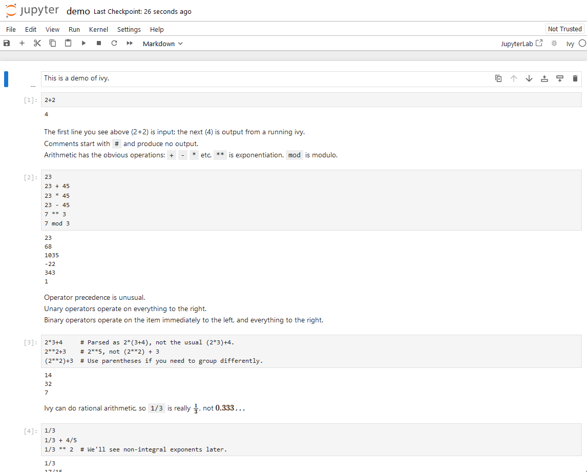

# Jupyter kernel for Ivy

A [Jupyter][] [kernel][] for [Rob Pike's ivy language][].
This allows using Ivy expressions inside a Jupyter notebook.
I made this primarily for my personal use, so there may be rough edges.



[Jupyter]: https://jupyter.org/
[kernel]: https://docs.jupyter.org/en/latest/projects/kernels.html
[Rob Pike's ivy language]: https://pkg.go.dev/robpike.io/ivy

## Installation

Use [Nix][] flakes:

```shell
nix profile install github:zombiezen/jupyter-ivy
```

Make sure that `$HOME/.nix-profile/share/jupyter` is in the [`JUPYTER_PATH`][].
Once installation is complete, ivy will show up as a kernel that can be used for notebooks.

[`JUPYTER_PATH`]: https://docs.jupyter.org/en/latest/use/jupyter-directories.html#data-files
[Nix]: https://nixos.org/

## Getting Started

The official ivy demo is included as a [notebook](demo.ipynb).

## License

[Apache 2.0](LICENSE)
